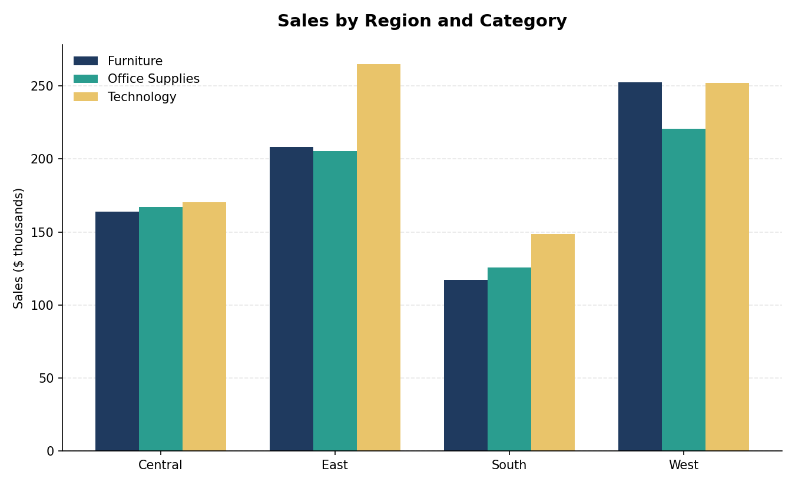
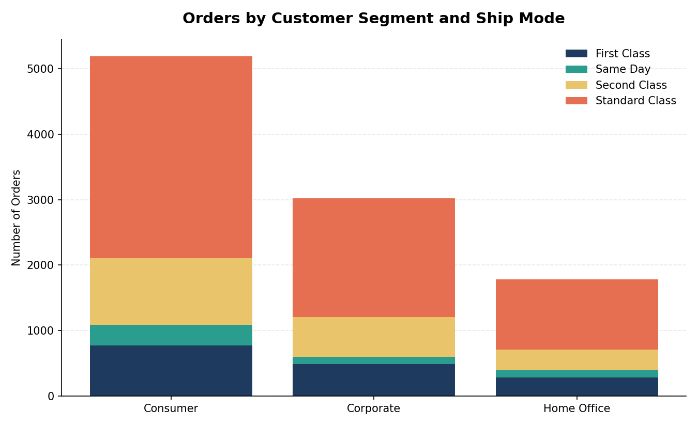
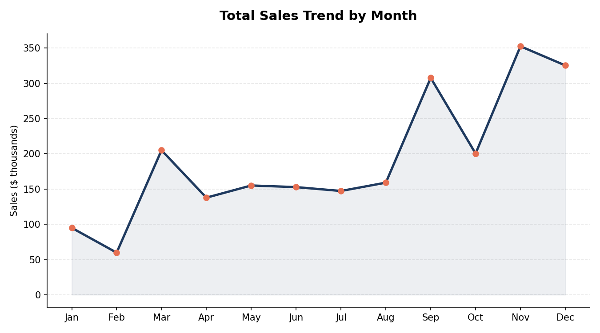

# Superstore Sales & Profitability Analysis

An end-to-end sales analysis of a retail "Superstore" dataset (9,994 orders, 793 customers, 2014–2017), built in Excel using PivotTables and PivotCharts to uncover trends in sales, profitability, regional performance, and customer behavior.

## 📊 Project Overview

Retail sales data often hides where a business actually makes (or loses) money. This project analyzes transaction-level order data to answer six core business questions and surface actionable insights for merchandising, regional strategy, and logistics decisions.

**Dataset:** 9,994 orders · 793 unique customers · $2.30M total sales · $286K total profit

## 🎯 Objectives

1. Identify the top 10 best-selling products by sales
2. Identify the bottom 10 lowest-selling customers by sales
3. Compare sales performance across regions, broken down by product category
4. Compare order volume by customer segment and shipment mode
5. Visualize sales trends over time (daily)
6. Visualize total sales trends over time (monthly)

## 🛠️ Tools & Techniques

- **Microsoft Excel** — PivotTables, PivotCharts, KPI summary cards
- Data cleaning and structuring of raw transactional order data
- Segmentation analysis (region × category, customer segment × ship mode)
- Time-series aggregation (daily and monthly sales trends)

## 🔑 Key Insights

### Sales by Region and Category


The **West** region generated the highest total sales (~$725K), followed by East (~$679K), Central (~$501K), and South (~$392K). Technology is the top-grossing category in the West and East, while in Central and South, sales are more evenly spread across all three categories.

### Orders by Customer Segment and Ship Mode


**Consumer** is the largest segment by order volume (5,191 orders, ~52% of all orders), followed by Corporate (3,020) and Home Office (1,783). Across every segment, **Standard Class** dominates shipping choice — accounting for ~60% of all orders (5,968 of 9,994) — suggesting most customers prioritize cost over delivery speed.

### Monthly Sales Trend


Sales show a clear seasonal pattern: a slow start in Jan–Feb, a spike in March, a mid-year plateau (Apr–Aug), and a strong ramp into **September and November–December** — consistent with back-to-school and holiday/year-end purchasing cycles.

### Profitability & Product Concentration
- Average sale value is ~$253 per order, with total profit of ~$286K on ~$2.30M in sales — an overall margin of roughly **12.5%**.
- Sales are concentrated in a relatively small number of high-performing products, while the bottom 10 customers by sales each contributed well under $100 in total, highlighting a long tail of low-value accounts.

## 📁 Repository Structure

```
superstore-sales-analysis/
├── README.md
├── data/
│   ├── superstore_analysis.xls   # Full analysis workbook (raw data + PivotTables + charts)
│   └── orders.csv                # Raw order-level data (portable format)
├── screenshots/
│   ├── regional_sales.png
│   ├── segment_shipmode.png
│   └── monthly_trend.png
└── .gitignore
```

## 🚀 How to Explore

1. Open `data/superstore_analysis.xls` in Excel to view the interactive PivotTables and charts (see sheets: `KPI`, `Sheet1`, `Orders`, `Returns`).
2. Alternatively, load `data/orders.csv` into Python/Pandas, Power BI, or Tableau for further analysis.

## 📈 Possible Next Steps

- Rebuild the analysis in Python (pandas + matplotlib/seaborn) or as an interactive Tableau/Power BI dashboard
- Add a discount-vs-profit analysis to identify which discount levels erode margin
- Build a customer lifetime value (CLV) model from the segment/region data

---
*Dataset: Sample Superstore retail dataset, commonly used for business intelligence and data analysis practice.*
