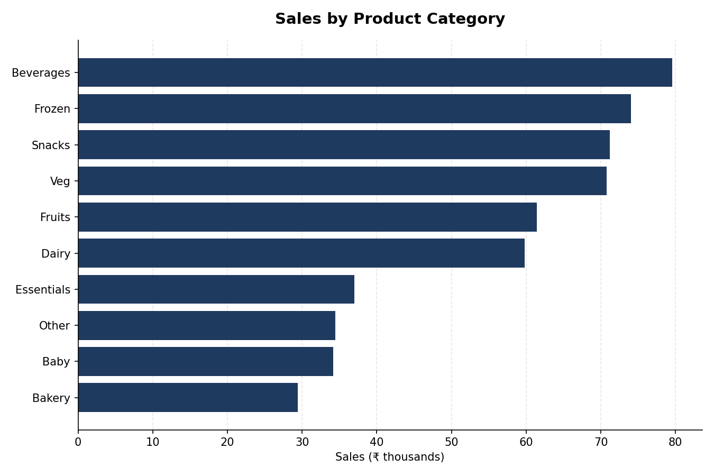
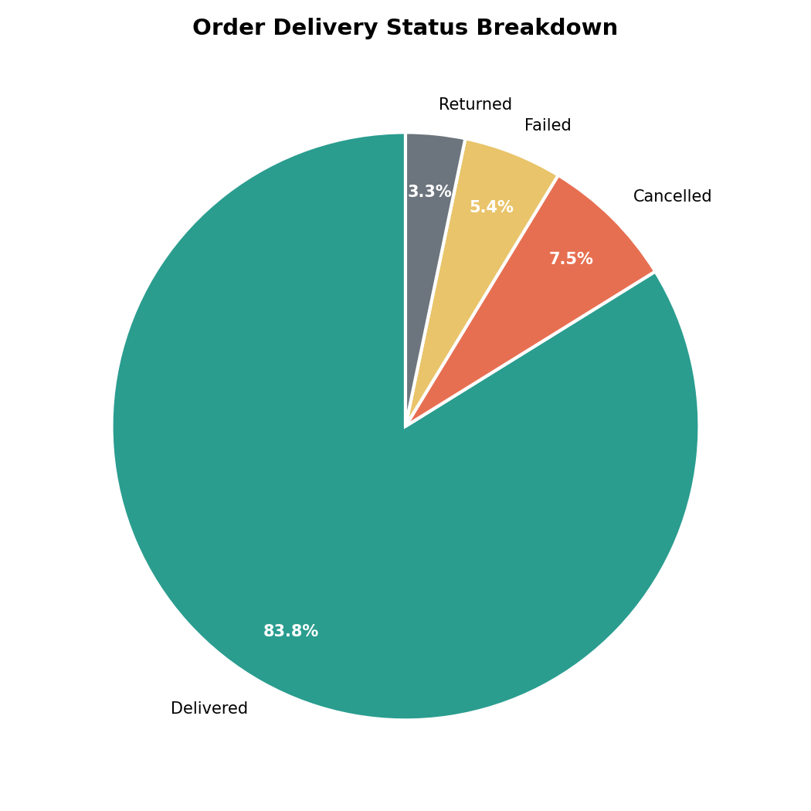
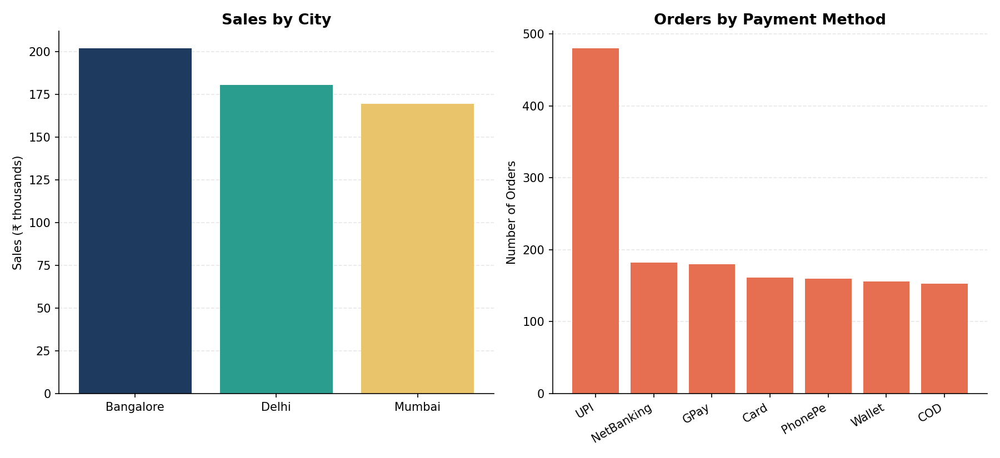

# Zepto Sales & Delivery Performance Analysis

An analysis of quick-commerce order data from Zepto, covering 1,472 orders across 300 customers, built using Excel PivotTables and PivotCharts to surface trends in category performance, delivery reliability, city-level demand, and payment behavior.

## 📊 Project Overview

Quick-commerce businesses live and die by delivery speed and reliability. This project digs into order-level data to answer: which categories drive revenue, how often deliveries fail or get cancelled, where demand is concentrated, and how customers choose to pay.

**Dataset:** 1,472 orders · 300 unique customers · ₹5,51,821 total sales · Avg. order value ₹374.88

## 🎯 Objectives

1. Identify the top 10 highest-value orders
2. Identify the top 10 customers by total spend
3. Identify the top 10 best-selling SKUs
4. Identify the bottom 10 lowest-value orders
5. Identify the bottom 10 customers by total spend
6. Identify the bottom 10 lowest-selling SKUs

## 🛠️ Tools & Techniques

- **Microsoft Excel** — PivotTables, PivotCharts, KPI summary cards
- Data cleaning (standardizing inconsistent category labels, e.g. "Fruits" vs "Fruits ")
- Category, city, and payment-method segmentation
- Delivery outcome analysis (Delivered / Cancelled / Failed / Returned)

## 🔑 Key Insights

### Sales by Product Category


**Beverages** (₹79.6K), **Frozen** (₹74.1K), and **Snacks** (₹71.2K) are the top revenue-driving categories, while Bakery and Baby products trail behind — useful signal for which categories to prioritize for inventory and placement.

### Order Delivery Status Breakdown


**83.8%** of orders were successfully delivered, but a combined **16.2%** were Cancelled (7.5%), Failed (5.4%), or Returned (3.3%) — a meaningful chunk of lost revenue and operational cost worth investigating further (e.g. by delivery slot or city).

### Sales by City & Payment Method


**Bangalore** leads in sales (₹2.02L), narrowly ahead of Delhi (₹1.81L) and Mumbai (₹1.69L). On payments, **UPI dominates** with 480 orders (33% of all transactions) — more than 2.5x any other single method — reflecting broader digital payment adoption trends in Indian quick-commerce.

### Order & Customer Value
- Average order value is **₹374.88**, with the top 10 highest-value orders alone contributing ₹14,584.72 in sales.
- The top 10 customers by spend are led by **Cust_10** (₹3,390.38) and **Cust_206** (₹3,274.87), while the bottom 10 customers combined contributed just ₹7,054.92 — highlighting a sharp gap between high-value and low-value accounts.

## 📁 Repository Structure

```
zepto-sales-analysis/
├── README.md
├── data/
│   ├── zepto_sales_analysis.xlsx   # Full analysis workbook (raw data + PivotTables + charts)
│   └── orders.csv                  # Raw order-level data (portable format)
├── screenshots/
│   ├── category_sales.png
│   ├── delivery_status.png
│   └── city_payment.png
└── .gitignore
```

## 🚀 How to Explore

1. Open `data/zepto_sales_analysis.xlsx` in Excel to view the interactive PivotTables and charts (see sheets: `KPI`, `Sheet4`, `Sheet1`).
2. Alternatively, load `data/orders.csv` into Python/Pandas, Power BI, or Tableau for further analysis.

## 📈 Possible Next Steps

- Break down cancellation/failure rate by city and delivery slot to identify operational bottlenecks
- Analyze delivery time vs. order value to see if high-value orders get prioritized
- Build a repeat-purchase / customer retention view using order dates per customer

---
*Dataset: Zepto quick-commerce order data (grocery/essentials delivery), used for business intelligence and data analysis practice.*
